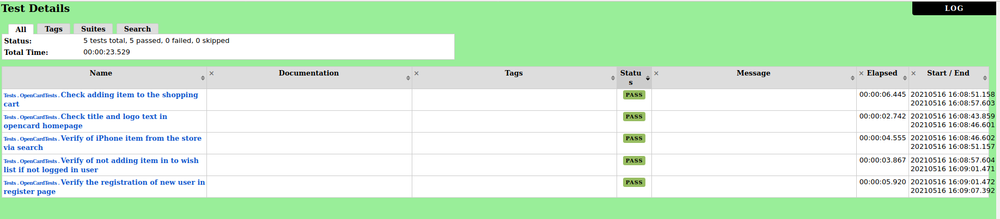

#Задание:
- Создать и настроить проект для автотестов с использованием RobotFramework.
- Реализовать 5 тестовых сценариев (на своё усмотрение) для приложения OpenCart.
- Скинуть скриншот отчётра робота вместе со ссылкой на pull-request

#Репорт

